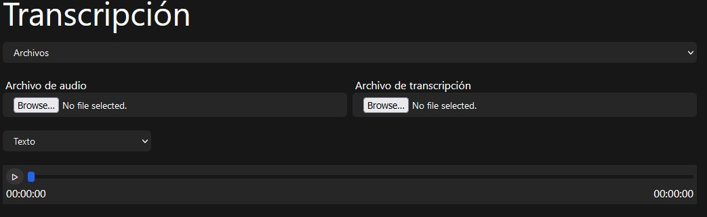
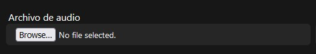
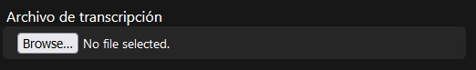
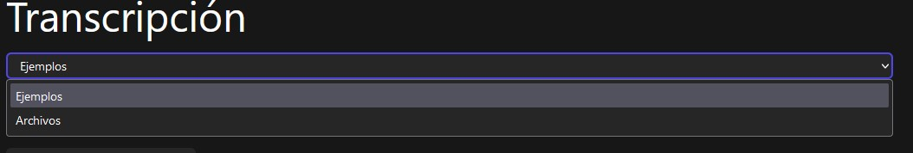
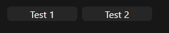
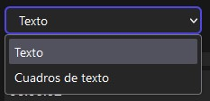
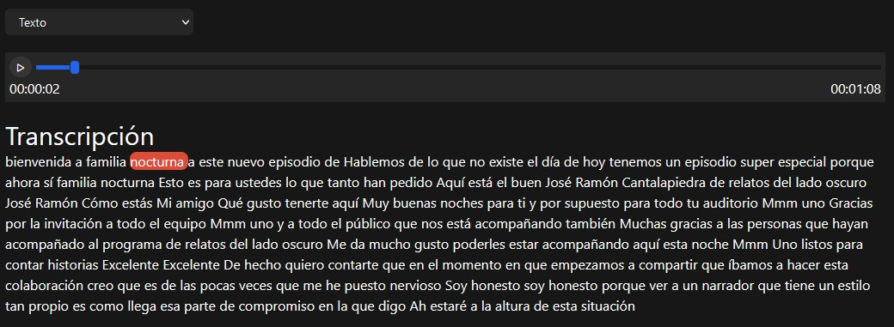
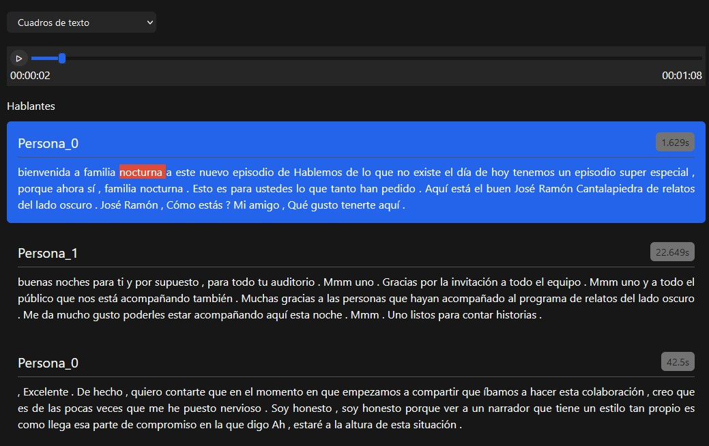

# Vista de transcripción

Es un programa rápido para la visualización de la transcripción realizada utilizando AWS Transcribe, esto es unicamente con fines demostrativos o para visualizar el texto de una transcripción

# Como utilizarlo

## Funciones

### Archivos personalizados

Al iniciar la aplicación se vera la primera opcion, la cual nos permite subir nuestros archivos realizados con AWS transcribe



Para visualizar nuestra transcripción se tiene que subir el audio y la transcripción para subirlo, ubicaremos el campo de Archivo de audio



Donde se podra subir tanto archivos `MP4` y `MP3`.

Luego tendremos que subir un archivo `json`, el cual contienen la transcripción

**Nota:** El sistema esta optimizado para procesar transcripciones realizadas por AWS Transcribe



### Demostración

Tambien tendremos el apartado demostrativo, donde tendremos demostraciones de archivos de audio y `json` de una transcripción previamente hecha. Para visualizarla tendremos que seleccionar ejemplos.



Tendremos dos ejemplos para poder visualizar como funciona la aplicación



## Vista

Ya sea que se selecciono una demostración o archivos propios, tendremos la interfaz donde podremos seleccionar entre dos opciones



### Texto

Si seleccionamos Texto, nos mostrara toda la transcripción en un solo texto y al momento de reproducir el audio, se ira moviendo el cursor



### Cuadros de texto

Cuando seleccionamos cuadros de texto, la interfaz cambiara y en lugar de texto, detectara a las personas que están hablando



# Configuración del entorno

## requisitos

-   Node 20
-   Vue 3.4

## Configuración

Una vez se clonara el repositorio, se tiene que instalar la dependencias correspondientes

```bash
npm install
```

Una vez se finalice la instalación de las dependencias iniciamos la aplicación

```bash
npm run dev
```

Se iniciara en `http://localhost:5173/` y ya se podrá utilizar la aplicación

## Construido con

Las herramientas utilizadas para crear la aplicación:

-   [Vite](https://vite.dev/) - Vista y componentes

## Autores

Esta aplicación fue creado por **David Riz (DeividAG)**

## Licencia

Propiedad de SekAiJK 2024
